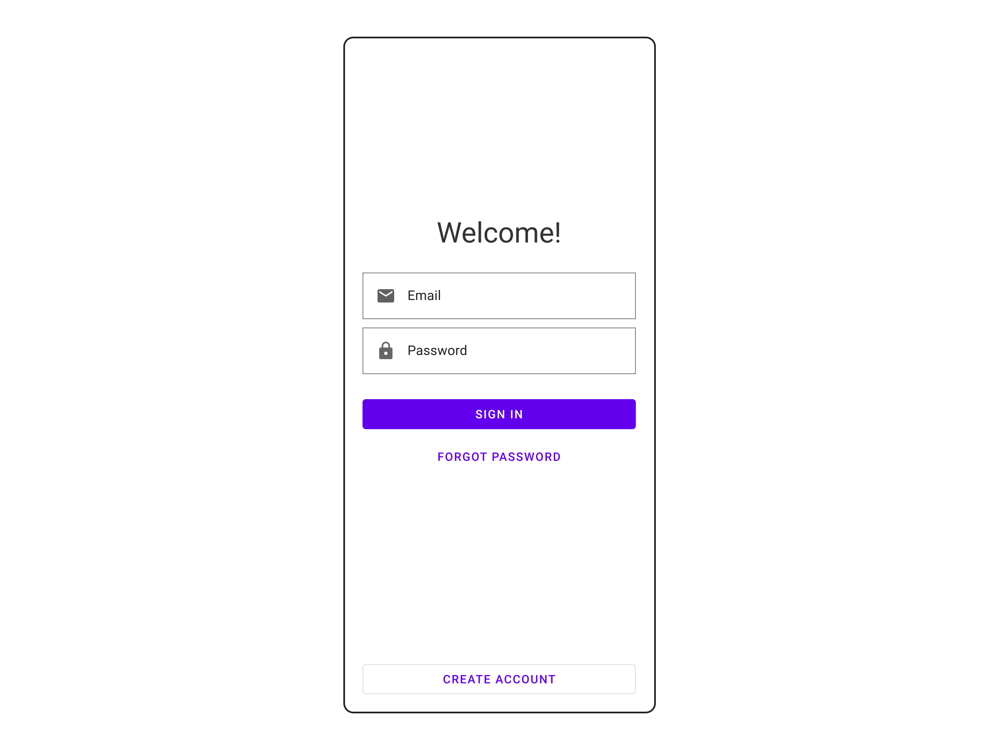

# Exercise: Login Screen with Material Design

## Overview

| Key | Value |
| --- | --- |
| Goal | Use a design system to create an interface. |
| Tools/Material | TextEditor, [Material Design Components](https://material.io/components?platform=web) |
| Duration | 2-3 hours |

## Steps

1. Open your text editor, and start a basic web project using your preferred web technologies. If you need extra help getting a web project started using Google's Material design, checkout their getting started page [here](https://material.io/develop/web/getting-started).
2. Create a login page in your project.
3. Using Material design import and use these components to build the mockup below:
    - [Text input](https://material.io/components/text-fields)
    - [Buttons](https://material.io/components/buttons)
4. Read the documentation and use the components properly.
5. Once you're done creating the ui, feel free to style it or make it your own using [material's theming capabilities](https://material.io/develop/web/theming/theming-guide). Try playing with color or shape!
6. Once you're done, grab your mentor and discuss!

## Questions

- What is a design system?
- Where you able to use the design system?
- Where you able to read the documentation?

## Reflection

Use the following questions to reflect on what you learned with this exercise:

- What conclusion can you share with your mentor?
- What surprised you about this exercise?
- Where do you want to go from here?

## Need help?

- [Join our Discord to ask questions](https://discord.gg/bDVYvG3Czd)
