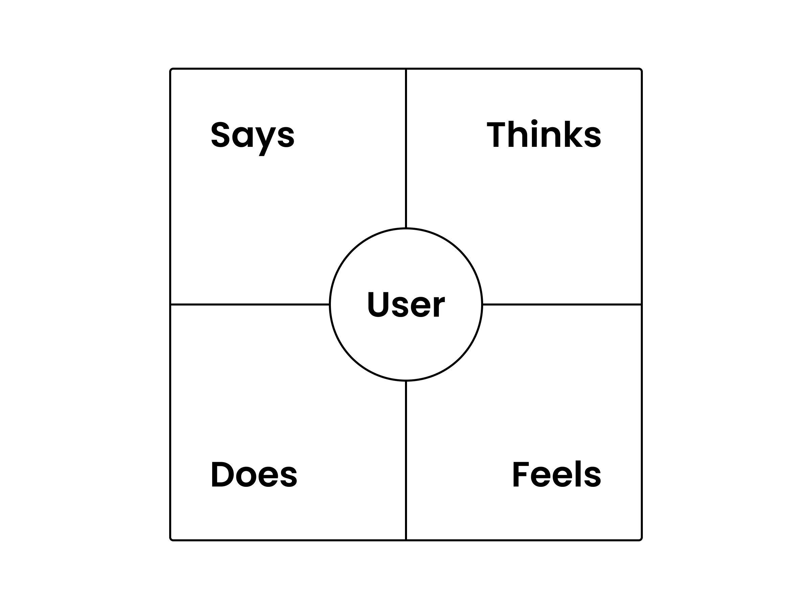

# Exercise: Process Observation (Empathy Mapping)

## Overview

| Key | Value |
| --- | --- |
| Goal | Learn to see from the customer’s perspective by observing them accomplish a goal. (Create a empathy map) |
| Tools/Material | Notebook & pencil or a digital white boarding tool (like a Miro, Invision Freehand or FigJam) |
| Duration | 2 hours |

## Steps

1. Identify a single consumer process that is easy to observe in public, and relatively simple. A good example could be something like *ordering a drink at a coffeeshop, or renting a book from the library*.
2. Next step is to setup camp... find a cozy place to sit for a bit, where you’ll be able to observe the steps someone takes throughout this identified process.
3. Before we start observing, we need to prep so we can observe our customers efficiently:
    - In your note taking tool, draw a large square. It should take up most the page.
    - The draw a small circle inside it, and label the circle with the term, ***user***. 
    - Then draw two intersecting lines so you have 4 equal sized squares. Label each square with one of these four labels: ***says**, **thinks**, **does**, and **feels***.  
    - It should look something like this, but don’t worry... it doesn’t have to be perfect:  
4. Now, in the user circle, we’re going to outline the type of people/persons that would go through this process. For instance, in our coffeeshop example; it could be generic like “customer”, or more specific like “moms ordering coffee”. Either way, try to identify and categorize one group of people in this process to observe, and write it down. It’s okay if there are multiple categories of customers, just pick on to focus on for this exercise. 
5. Time for the fun part! Focus on observing about **5-10 different people** that match your category you called out, and watch them go through your identified process. 
6. Take notes on what they are ***saying***, ***seeing***, ***feeling***, and ***doing*** throughout the process, in each corresponding square. For example: **does** = “looks at the menu”, **says** = “talks about their day”, or **feels** = “upset because it took a long time to get an order”. 
7. Don’t worry about writing every single detail about a single person... focus on what you think is important, and since you’re observing multiple people, you can capture a missed detail later.
8. Once you observe 5-10 people, go through your notes and mark observations that happened more frequently, and callout things that seemed important to that customer in their process. This could be happy moments, sad moments, or pain points, or areas of improvement.
9. Grab your mentor and discuss!

## Questions

- What was the user group you focused on, and what was the process you observed them do?
- What where something that you noticed every or most of the people doing/saying/feeling/seeing?

## Reflection

Use the following questions to reflect on what you learned with this exercise:

- What conclusion can you share with/show your mentor?
- Do you feel like you learned something new about the people you observed, that you wouldn’t have expected?
    - How many people did you have to observe before learning that?
- What are some ideas you have for improving the process, to work better for the group you observed?
    - How would you prototype your improvements to the process?
- Where do you want to go from here?

## Need help?

- [Join our Discord to ask questions](https://discord.gg/bDVYvG3Czd)
